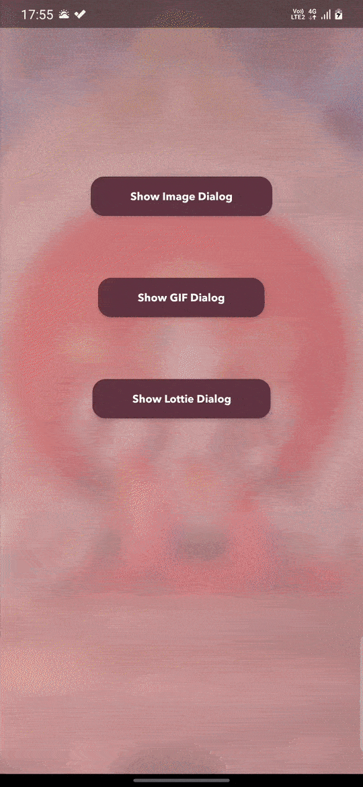

# BeautifulProgressDialog
Brush up your mobile app with customized Progress Dialog. Beautiful Progress Dialog is a small library that let you show custom Progress Dialog into your app. It can show static images, GIFs and the new Lottie Animation.


**View** can be of three types:
1. Image
2. GIF
3. Lottie Animation

To add BeautifulProgressDialog into your app,
Step 1. Add the JitPack repository to your build file
```
allprojects {
        repositories {
			...
            maven { url 'https://jitpack.io' }
        }
    }
  ```
  Step 2. Add the dependency
  ```
  dependencies {
	        implementation 'com.github.basusingh:BeautifulProgressDialog:1.001'
	}
  ```
 Current Version:  [](https://jitpack.io/#basusingh/BeautifulProgressDialog)


 **Create a dialog**
 ```
 //Params: Context, View Type, Text Message
 BeautifulProgressDialog progressDialog = new BeautifulProgressDialog(MainActivity.this, 
 									BeautifulProgressDialog.withImage,
									    "Please wait");
 ```
 
 
 
 **View Type:**
 ```
BeautifulProgressDialog.withImage
BeautifulProgressDialog.withGIF
BeautifulProgressDialog.withLottie
```


**Create an Image Dialog with Text Message**
```
progressDialog = new BeautifulProgressDialog(MainActivity.this, BeautifulProgressDialog.withImage, "Please wait");
progressDialog.setImageLocation(getResources().getDrawable(R.drawable.burger_logo));
progressDialog.setLayoutColor(getResources().getColor(R.color.cream));
```


**Create a GIF Dialog without Text Message**
```
progressDialog = new BeautifulProgressDialog(MainActivity.this, BeautifulProgressDialog.withGIF, null);
Uri myUri = Uri.fromFile(new File("//android_asset/sample_gif_1.gif"));
progressDialog.setGifLocation(myUri);
```


**Create a Lottie Animation Dialog without Text Message**
```
progressDialog = new BeautifulProgressDialog(MainActivity.this, BeautifulProgressDialog.withLottie, null);
progressDialog.setLottieLocation("lottie_1.json");
//Loop the Lottie Animation
progressDialog.setLottieLoop(true);
```


**Show the Dialog**
```
progressDialog.show();
```


**Dismiss the Dialog**
```
progressDialog.dismiss();
```


**Additional Style**

**Set Background Color**
```
progressDialog.setLayoutColor(getResources().getColor(R.color.MY_COLOR_NAME));
```


**Change View Type**
```
progressDialog.setViewType(BeautifulProgressDialog.withGIF);
```
**Don't forget to change the source of each view type**


Available methods:
```
//Set Image Resource
setImageLocation(Drawable drawable)
setImageLocation(Bitmap bitmap)
setImageLocation(Uri location)

//Set GIF Resource
setGifLocation(Uri gifLocation)

//Set Lottie Resource
setLottieLocation(String url)
```


**Custom font for the message**
```
//By default, the font is avenir_bold
setFont(String font)
```


**Change message**
```
setMessage(String text)
```


**Remove message**
```
removeMessage()
```


**Additional Methods:**
```
//Dialog cancelable on touch outside
setCancelableOnTouchOutside(boolean value)
```


   


Please feel free to customize it according to your need. I will be constantly adding new features.
Currently, I'm currently adding a Progress Bar and rounded corners to the view.

Cheers!

___________________________________________________________________

MIT License

Copyright (c) 2020 Basu

Permission is hereby granted, free of charge, to any person obtaining a copy
of this software and associated documentation files (the "Software"), to deal
in the Software without restriction, including without limitation the rights
to use, copy, modify, merge, publish, distribute, sublicense, and/or sell
copies of the Software, and to permit persons to whom the Software is
furnished to do so, subject to the following conditions:

The above copyright notice and this permission notice shall be included in all
copies or substantial portions of the Software.

THE SOFTWARE IS PROVIDED "AS IS", WITHOUT WARRANTY OF ANY KIND, EXPRESS OR
IMPLIED, INCLUDING BUT NOT LIMITED TO THE WARRANTIES OF MERCHANTABILITY,
FITNESS FOR A PARTICULAR PURPOSE AND NONINFRINGEMENT. IN NO EVENT SHALL THE
AUTHORS OR COPYRIGHT HOLDERS BE LIABLE FOR ANY CLAIM, DAMAGES OR OTHER
LIABILITY, WHETHER IN AN ACTION OF CONTRACT, TORT OR OTHERWISE, ARISING FROM,
OUT OF OR IN CONNECTION WITH THE SOFTWARE OR THE USE OR OTHER DEALINGS IN THE
SOFTWARE.

